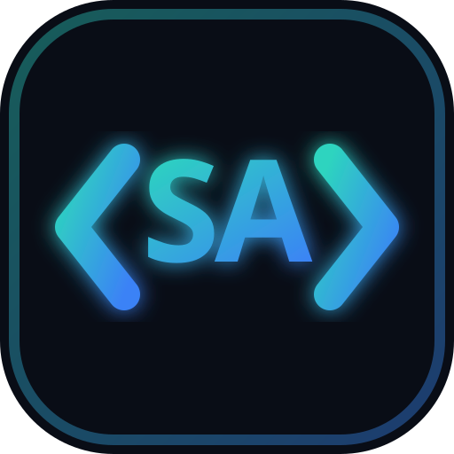

<div align="center">

#  SOHEIL AGHAYANI
### **Bridging Environmental Engineering & Advanced Software Architecture**

[](https://soheil-aghayani.github.io/)
[](https://github.com/Soheil-Aghayani/Soheil-Aghayani)
[](https://www.linkedin.com/in/agseyl/)
[](https://t.me/AgSeyl)
[](mailto:soheil.aghayani@ut.ac.ir)

<br/>

## Writing

- [کافپن (کاف‌پن / Coffpen)](https://soheil-aghayani.github.io/Coffpen/) — the independent Persian storytelling blog of Soheil Aghayani, with short stories, serial collections, and personal notes.
- [Coffpen repository](https://github.com/Soheil-Aghayani/Coffpen)

<!-- ANIMATION 1: Dynamic Typing Subtitle -->
<p align="center">
  <picture>
    <source media="(prefers-color-scheme: dark)" srcset="https://readme-typing-svg.demolab.com?font=Fira+Code&weight=600&size=20&pause=1000&color=00F2FE&center=true&vCenter=true&width=750&lines=M.Sc.+Environmental+Engineering+%40+University+of+Tehran;Biofuel+Synthesis+%26+Heterogeneous+Catalysis+Researcher;Python+%2C+C%23+%26+WPF+Custom+Software+Developer;Life+Cycle+Assessment+(LCA)+%26+SimaPro+Specialist">
    <source media="(prefers-color-scheme: light)" srcset="https://readme-typing-svg.demolab.com?font=Fira+Code&weight=600&size=20&pause=1000&color=0969DA&center=true&vCenter=true&width=750&lines=M.Sc.+Environmental+Engineering+%40+University+of+Tehran;Biofuel+Synthesis+%26+Heterogeneous+Catalysis+Researcher;Python+%2C+C%23+%26+WPF+Custom+Software+Developer;Life+Cycle+Assessment+(LCA)+%26+SimaPro+Specialist">
    
  </picture>
</p>

<!-- ANIMATION 2: Animated GitHub Profile Trophies -->
<p align="center">
  <picture>
    <source media="(prefers-color-scheme: dark)" srcset="https://github-profile-trophy.vercel.app/?username=Soheil-Aghayani&theme=tokyonight&no-frame=true&no-bg=true&margin-w=4">
    <source media="(prefers-color-scheme: light)" srcset="https://github-profile-trophy.vercel.app/?username=Soheil-Aghayani&theme=flat&no-frame=true&no-bg=true&margin-w=4">
    
  </picture>
</p>

<p align="center">
  <b>Transforming complex environmental data and chemical kinetics into sustainable solutions through computational simulation, custom software development, and experimental laboratory research.</b>
</p>

</div>

## Analytics setup

Google Analytics is opt-in and disabled by default. To enable privacy-conscious GA4 page views and interaction events for the deployed site, set the web data stream ID in `js/site-config.js`:

```js
analyticsMeasurementId: 'G-XXXXXXXXXX'
```

The client disables Google signals and ad personalization, does not send analytics requests in local previews or forks without a valid ID, and excludes email and telephone links from interaction tracking.

---

##  TECHNICAL ARSENAL & INTERACTIVE SKILLS MATRIX

<!-- ANIMATION 3: Dynamic Vibrant Vector Tech Grid -->
<div align="center">
  <a href="https://skillicons.dev">
    
  </a>
</div>

<br/>

<div align="center">

| Domain | Specialized Tools, Software & Methodologies |
| :--- | :--- |
| ** Software Engineering** | `Python` - `C#` - `WPF (.NET)` - `Git & GitHub` - `HTML5 / CSS3` - `Object-Oriented Programming (OOP)` - `Desktop Automation` |
| ** Environmental Modeling** | `SimaPro (Life Cycle Assessment)` - `LandGEM (Landfill Gas Modeling)` - `GIS Spatial Analysis` - `Solid Waste Siting` |
| ** Engineering Analytics** | `Reaction Kinetics Modeling` - `Heterogeneous Catalysis Synthesis` - `Data Processing (Pandas / NumPy)` - `Wet-Lab Testing` |

</div>

---

##  ACADEMIC JOURNEY & INDUSTRY LEADERSHIP

### ENGINEERING EDUCATION

<div align="center">
  <table>
    <tr>
      <td width="6%" align="center">
        
      </td>
      <td width="94%">
        <p><b>Master of Science in Environmental Engineering</b> | <i>University of Tehran (Present)</i><br>
        - <b>Academic Performance:</b> GPA 3.81 / 4.00 (19.06 / 20.00)<br>
        - <b>Core Research Areas:</b> Solid Waste Valorization, Biofuel Synthesis, Advanced Oxidation Processes (AOPs), and SimaPro LCA.</p>
      </td>
    </tr>
    <tr>
      <td width="6%" align="center">
        
      </td>
      <td width="94%">
        <p><b>Bachelor of Science in Civil Engineering</b> | <i>Shahed University (2018 – 2022)</i><br>
        - <b>Academic Performance:</b> GPA 2.93 / 4.00<br>
        - <b>Foundational Training:</b> Structural Analysis, Environmental Hydraulics, Project Management, and Sustainable Urban Infrastructure.</p>
      </td>
    </tr>
  </table>
</div>

---

### PROFESSIONAL EXPERIENCE

```yaml
- TECHNICAL EXPERT @ ARVIN SAROUJ PAY (TEHRAN | MAR 2024 – OCT 2025):
    - Spearheaded Health, Safety, and Environment (HSE) site compliance, conducting rigorous risk assessments and daily worker safety training.
    - Contributed directly to R&D engineering teams optimizing energy-efficient building layouts and sustainable material selection.

- TECHNICAL EXPERT @ SEDNA (TEHRAN | MAY 2022 – APR 2024):
    - Supervised multi-disciplinary construction and installation workflows for an industrial factory manufacturing electronic thermal devices.
    - Managed project timelines, quality assurance check-sheets, and technical contractor coordination from foundation to commissioning.
