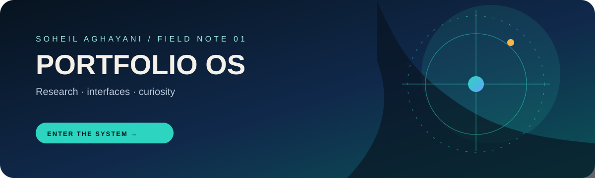

<div align="center">
  

  

  # SOHEIL AGHAYANI

  ### Environmental Engineering, Research, and Software Architecture

  <p>
    A living portfolio that turns environmental research into interactive systems,<br>
    practical tools, and small experiments worth exploring.
  </p>

  <a href="https://soheil-aghayani.github.io/">
    
  </a>
  <a href="https://soheil-aghayani.github.io/projects.html">
    
  </a>
  <a href="https://github.com/Soheil-Aghayani">
    
  </a>
</div>

<br>

<div align="center">

`RESEARCHER`  /  `ENGINEER`  /  `BUILDER`

`Python`  `JavaScript`  `C#`  `WPF`  `SimaPro`  `LCA`

</div>

## The idea

This repository powers the personal portfolio of **Soheil Aghayani**, an environmental engineer and software developer focused on sustainability research, waste valorization, biofuel production, life cycle assessment, data analysis, and usable software.

The site is deliberately more than a list of credentials. It is a small interactive environment where the portfolio, research process, terminal, games, notes, and visual experiments share one coherent interface.

```text
$ whoami
soheil-aghayani

$ mission
turn complex environmental data into clear, sustainable decisions

$ medium
research + software + visual systems
```

## Explore the site

| Surface | What is inside |
| --- | --- |
| [Portfolio](https://soheil-aghayani.github.io/) | Education, professional experience, publications, training, skills, and contact details |
| [Projects](https://soheil-aghayani.github.io/projects.html) | Interactive web projects, tools, design experiments, and science-focused applications |
| Interactive terminal | Personal profile commands, research summary, contact links, notes, games, and screensavers |
| Flowchart viewer | A pannable and zoomable view of the biodiesel research process |
| Notes app | Browser-local notes with terminal listing and JSON export |
| Game Center | Seven canvas-based games inside a macOS-inspired window |

## Interactive systems

### Terminal

Open the `Hello_World` prompt or use the terminal trigger, then try:

```text
help
bio
thesis
thesis flowchart
skills
contact
play
play minesweeper
notes
screensaver
screensaver list
screensaver dvd
```

`screensaver` without an argument selects a random theme. Explicit themes include `starfield`, `matrix`, `dvd`, `synthwave`, and `quantum`.

### Game Center

The launcher currently includes:

- Snake
- Blackjack
- Tetris
- 2048
- Minesweeper
- Breakout
- Space Shooter

Games are loaded on demand so the landing experience does not pay the cost of every game at first paint.

### Research interaction

The portfolio presents research as a process rather than a single paragraph. The flowchart viewer supports pan, zoom, reset, focus-loss feedback, and keyboard or pointer interaction. The thesis content covers calcium oxide catalysts derived from waste seashells, waste cooking oil conversion, biodiesel production, and life cycle assessment.

## Engineering profile

| Track | Focus |
| --- | --- |
| Environmental engineering | Solid waste management, circular economy, biofuel synthesis, environmental impact assessment |
| Modeling and analysis | SimaPro, OpenLCA, LandGEM, GIS workflows, data processing, reaction kinetics |
| Software engineering | Python, C#, WPF, JavaScript, HTML, CSS, canvas-based interfaces, automation |
| Research practice | Heterogeneous catalysis, waste valorization, laboratory work, technical communication |

## Technical shape

The frontend is intentionally framework-free. It uses semantic HTML, custom CSS, modern browser APIs, and focused JavaScript modules rather than a large application runtime.

```text
index.html                  Main portfolio and interactive landing page
projects.html               Standalone project showcase
css/os.css                  Shared operating-system and game window styles
js/
  app.js                    Core page boot and UI wiring
  icons.js                  Local SVG IconRegistry
  os.js                     Window manager for terminal, notes, and games
  terminal.js               Terminal command system
  notes.js                  Browser-local notes application
  landing-effects.js        Particle field and screensaver engine
  games/                    Lazy-loaded game modules
assets/
  icons/                    Canonical SVGs, generated sprite, and manifest
  images/                   Portfolio, game, and miner artwork
  audio/                    Local audio tracks
tools/assets/               Repeatable asset and sprite tooling
server.js                   Small local development server
```

## Local SVG icon system

Icons are part of the product surface, not a runtime dependency fetched from a font provider.

- Canonical SVGs live under `assets/icons/`.
- `assets/icons/sprite.svg` is the runtime sprite.
- `assets/icons/manifest.json` records paths, source categories, and duplicate decisions.
- `js/icons.js` exposes the shared `IconRegistry` for static and dynamically-created UI.
- UI icon fonts, pictographic emoji, and runtime external SVG downloads are not used.

After changing a canonical icon, rebuild the sprite from the repository root:

```powershell
node tools/assets/build-icon-sprite.js
```

Read [ICON_DECISIONS.md](ICON_DECISIONS.md) for the visual and licensing decisions behind the asset system.

## Performance principles

- Keep the landing page useful before non-critical interaction code arrives.
- Defer heavy effects and game modules until they are needed.
- Use local SVG sprite references instead of icon-font downloads.
- Lazy-load game artwork and warm game modules during idle time.
- Use `content-visibility` for below-the-fold content where appropriate.
- Keep analytics opt-in and disabled by default in `js/site-config.js`.

## Run locally

Requirements: Node.js and npm.

```powershell
git clone https://github.com/Soheil-Aghayani/Soheil-Aghayani.github.io.git
cd Soheil-Aghayani.github.io
npm install
npm start
```

Then open [http://127.0.0.1:8080](http://127.0.0.1:8080).

The repository uses `main` as its single deployment branch. There is no frontend build step; the local server exists to provide correct static-file behavior during development.

## Analytics and privacy

Google Analytics is disabled by default. To opt in for the deployed site, set a valid measurement ID in `js/site-config.js`:

```js
analyticsMeasurementId: 'G-XXXXXXXXXX'
```

Local notes stay in the browser until explicitly exported. No analytics requests are sent from local previews or forks without a valid ID.

## Contact

- [LinkedIn](https://www.linkedin.com/in/agseyl/)
- [GitHub](https://github.com/Soheil-Aghayani)
- [Telegram](https://t.me/AgSeyl)
- [Email](mailto:soheil.aghayani@ut.ac.ir)

<div align="center">
  <br>
  <sub>Built with curiosity, environmental science, and too many terminal experiments.</sub>
</div>
